# Full-Stack E-Commerce Website
## Overview
This is a full-stack eCommerce web application built using React (Vite) for the frontend and admin panel, and Express (Node.js) for the backend.
It provides core e-commerce functionalities such as product management, user authentication, and secure API communication.

## Tech Stack
### Frontend & Admin
- ⚛️ React (Vite)
- 🔀 React Router DOM — for navigation
- 🎨 Tailwind CSS (optional styling framework if used)

### Backend
- 🟢 Node.js & Express
- 📦 Mongoose — for MongoDB database connection
- 🧾 Multer — for image/file uploads
- 🔐 JSON Web Token (JWT) — for authentication
- 🌐 CORS — for cross-origin API communication

### Database
- 🗄️ MongoDB (Atlas)

## Features
- User signup/login with JWT authentication
- Product listing and details
- Product upload and management (via admin)
- Image/file upload using Multer
- Secure RESTful API
- Integration between frontend, admin, and backend

## Packages Used
### Frontend:
  - react
  - react-router-dom
  - vite
### Backend:
  - express
  - mongoose
  - cors
  - multer
  - jsonwebtoken
  - dotenv

## Setup Frontend
- npm install
- npm run dev

## Setup Admin Panel
- npm install 
- npm run dev

## Backend
- node ./index.js

## Require Packages
- npm i express
- npm i react-router-dom
- npm i cors
- npm i multer
- npm i jsonwebtoken
- npm i mongoose

## Screenshots
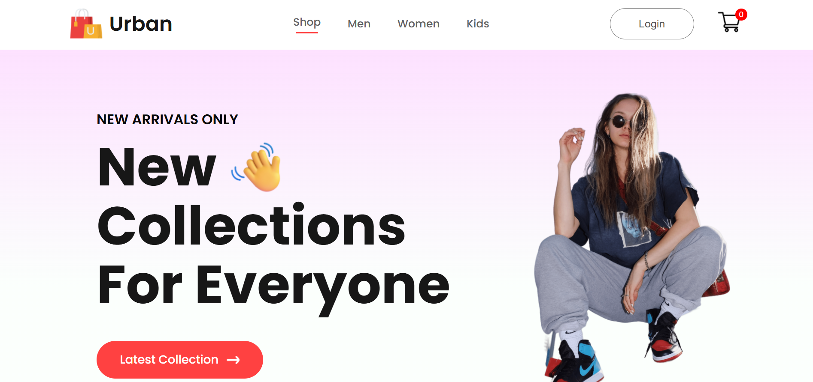

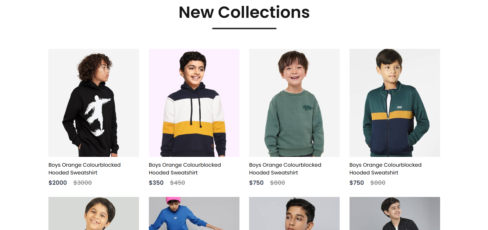
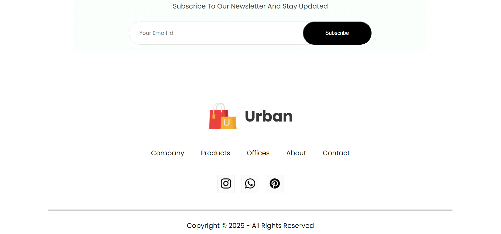
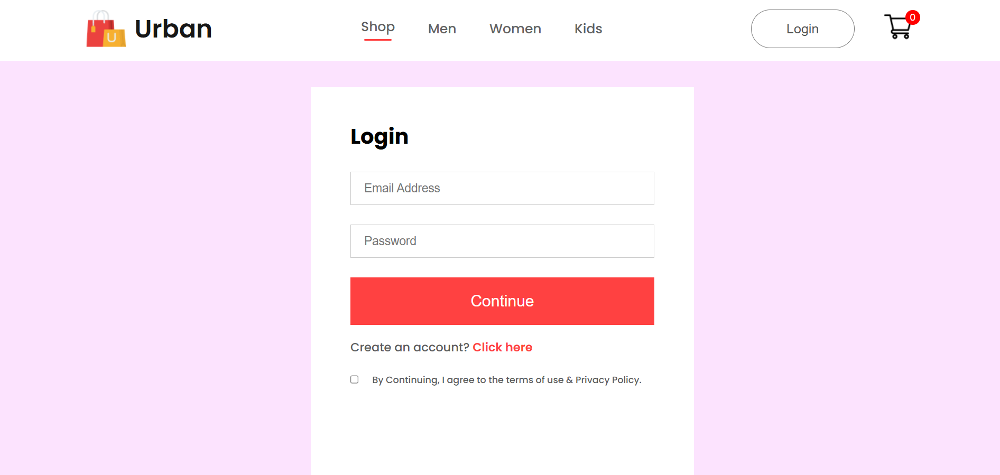
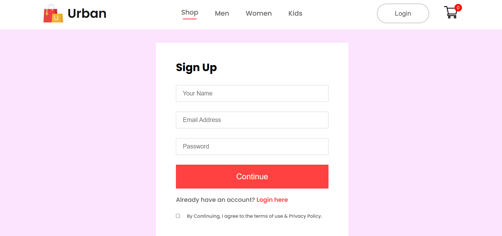
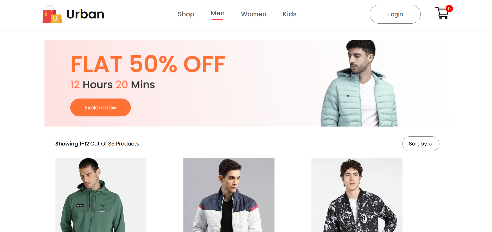
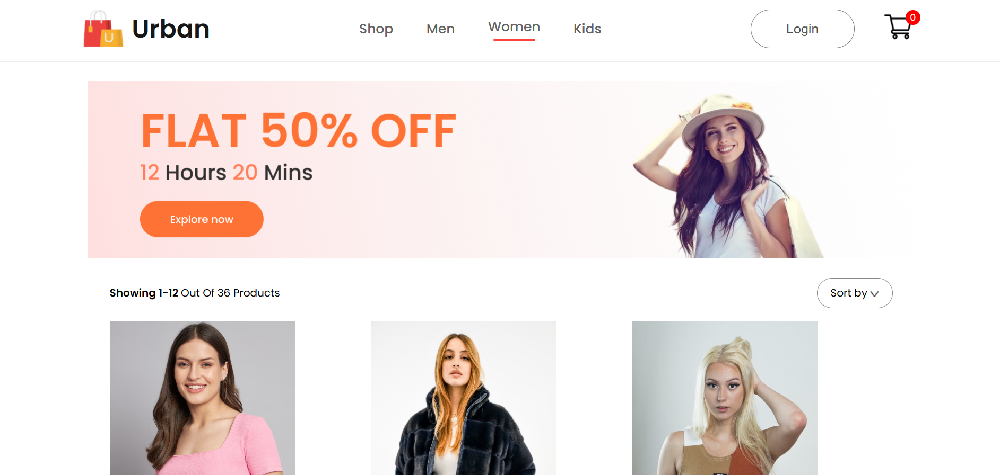
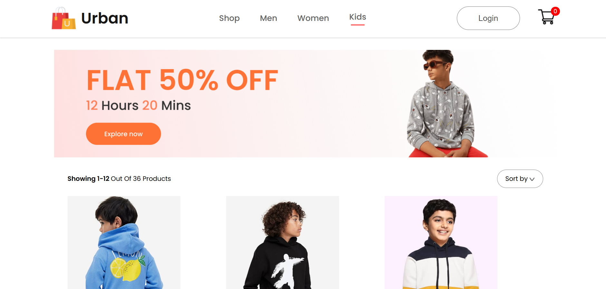
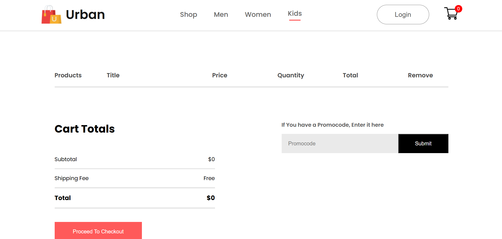
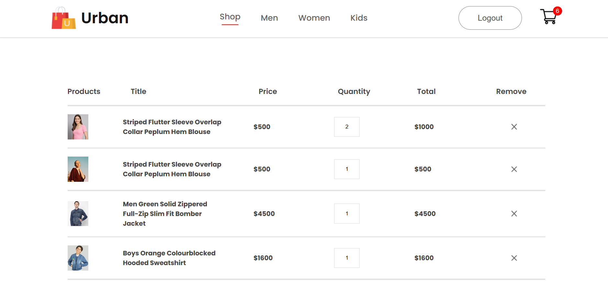
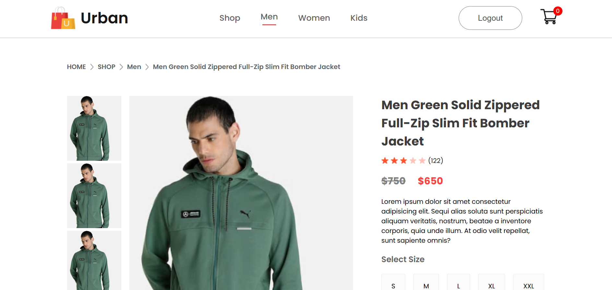
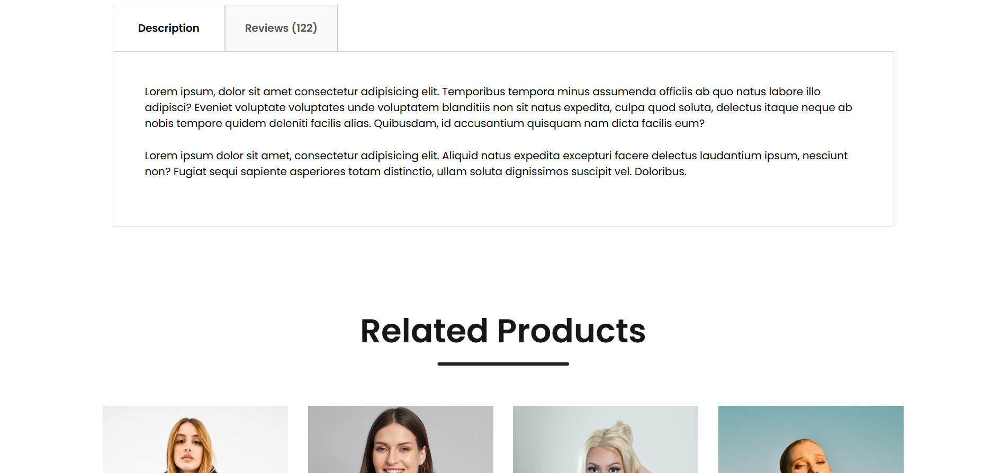
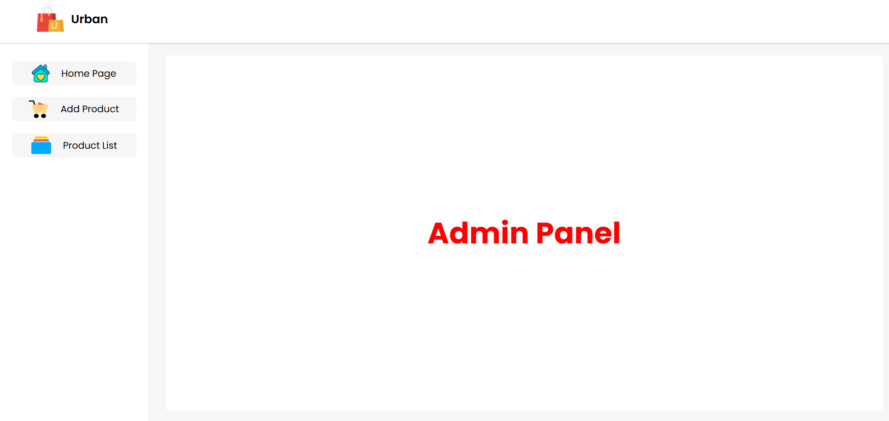
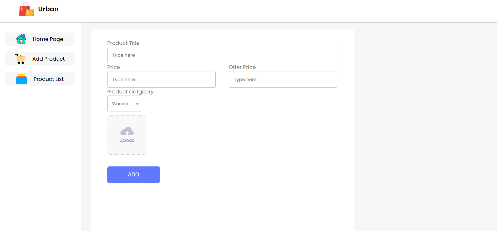
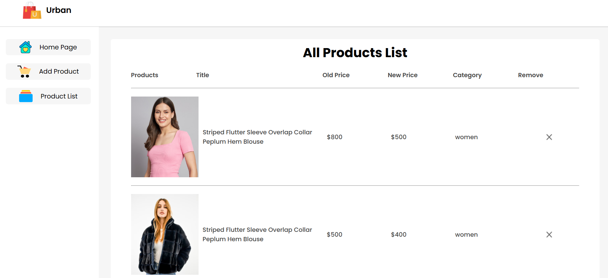

## Additional Information
### Before Using this repo
- Add Assets folder in Components folder of Frontend and Admin.
- Add upload/images folder in Backend for storing images.
